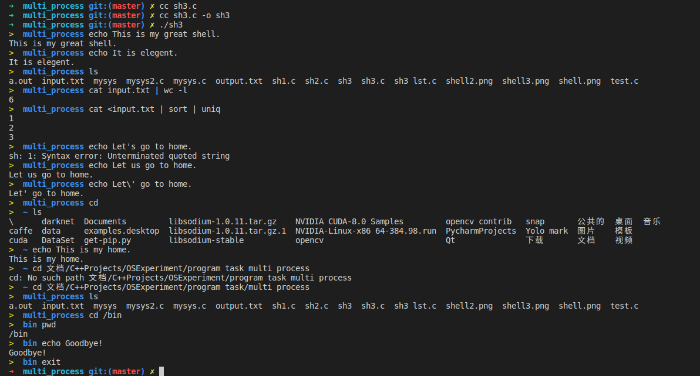

# OSExperiment

Operating system experiment, NUAA

## Preview
- [shell3.c](program_task/multi_process/sh3.c)


## Table of Contents

- [OS Experiment](#osexperiment)
    1. [File R/W](#file-r/w)
    1. [Multiprocess](#multi-process)
    1. [MUltithread](#multi-thread)

## File R/W

### [myecho.c](program_task/file_read_write/myecho.c)

- myecho.c的功能与系统echo程序相同
- 接受命令行参数，并将参数打印出来，例子如下：
    ```shell
    $ ./myecho x
    x
    $ ./myecho a b c
    a b c
    ```
### [mycat.c](program_task/file_read_write/mycat.c)
- mycat.c的功能与系统cat程序相同
- mycat将指定的文件内容输出到屏幕，例子如下：
- 要求使用系统调用open/read/write/close实现
    ```shell
    $ cat /etc/passwd 
    root:x:0:0:root:/root:/bin/bash
    daemon:x:1:1:daemon:/usr/sbin:/usr/sbin/nologin
    bin:x:2:2:bin:/bin:/usr/sbin/nologin
    ...
    $ ./mycat /etc/passwd 
    root:x:0:0:root:/root:/bin/bash
    daemon:x:1:1:daemon:/usr/sbin:/usr/sbin/nologin
    bin:x:2:2:bin:/bin:/usr/sbin/nologin
    ...
    ```
### [mycp.c](program_task/file_read_write/mycp.c)
- mycp.c的功能与系统cp程序相同
- 将源文件复制到目标文件，例子如下：
- 要求使用系统调用open/read/write/close实现
    ```shell
    $ cat /etc/passwd
    root:x:0:0:root:/root:/bin/bash
    daemon:x:1:1:daemon:/usr/sbin:/usr/sbin/nologin
    bin:x:2:2:bin:/bin:/usr/sbin/nologin
    ...
    $ ./mycp /etc/passwd passwd.bak 
    $ cat passwd.bak
    root:x:0:0:root:/root:/bin/bash
    daemon:x:1:1:daemon:/usr/sbin:/usr/sbin/nologin
    bin:x:2:2:bin:/bin:/usr/sbin/nologin
    ...
    ```

## Multi-process

### [mysys.c](program_task/multi_process/mysys2.c)

- **实现函数mysys，用于执行一个系统命令，要求如下**
- mysys的功能与系统函数system相同，要求用进程管理相关系统调用自己实现一遍
- 使用fork/exec/wait系统调用实现mysys
- 不能通过调用系统函数system实现mysys
- 测试程序
    ```c
    #include <stdio.h>

    int main()
    {
        printf("--------------------------------------------------\n");
        system("echo HELLO WORLD");
        printf("--------------------------------------------------\n");
        system("ls /");
        printf("--------------------------------------------------\n");
        return 0;
    }
    ```
- 测试程序的输出结果
    ```shell
    --------------------------------------------------
    HELLO WORLD
    --------------------------------------------------
    bin    core  home	     lib	 mnt   root  snap  tmp	vmlinuz
    boot   dev   initrd.img      lost+found  opt   run   srv   usr	vmlinuz.old
    cdrom  etc   initrd.img.old  media	 proc  sbin  sys   var
    --------------------------------------------------
    ```

### [sh1.c](program_task/multi_process/sh1.c)

- **实现shell程序，要求具备如下功能**
- 支持命令参数
    ```shell
    $ echo arg1 arg2 arg3
    $ ls /bin /usr/bin /home
    ```
- 实现内置命令cd、pwd、exit
    ```shell
    $ cd /bin
    $ pwd
    /bin
    ```

### [sh2.c](program_task/multi_process/sh2.c)

- **实现shell程序，要求在第1版的基础上，添加如下功能**
- 实现文件重定向
    ```shell
    $ echo hello >log
    $ cat log
    hello
    ```

### [sh3.c](program_task/multi_process/sh3.c)

- **实现shell程序，要求在第2版的基础上，添加如下功能**
- 实现管道
    ```shell
    $ cat /etc/passwd | wc -l
    ```
- 实现管道和文件重定向
    ```shell
    $ cat input.txt
    3
    2
    1
    3
    2
    1
    $ cat <input.txt | sort | uniq | cat >output.txt
    $ cat output.txt
    1
    2
    3
    ```

## MUlti-thread

### [pi1.c](program_task/multi_thread/pi1.c)

- **使用2个线程根据莱布尼兹级数计算PI**
- 莱布尼兹级数公式: 1 - 1/3 + 1/5 - 1/7 + 1/9 - ... = PI/4
- 主线程创建1个辅助线程
- 主线程计算级数的前半部分
- 辅助线程计算级数的后半部分
- 主线程等待辅助线程运行結束后,将前半部分和后半部分相加

### [pi2.c](program_task/multi_thread/pi2.c)

- **使用N个线程根据莱布尼兹级数计算PI**
- 与上一题类似，但本题更加通用化，能适应N个核心，需要使用线程参数来实现
- 主线程创建N个辅助线程
- 每个辅助线程计算一部分任务，并将结果返回
- 主线程等待N个辅助线程运行结束，将所有辅助线程的结果累加

### [sort.c](program_task/multi_thread/sort.c)

- **多线程排序**
- 主线程创建一个辅助线程
- 主线程使用选择排序算法对数组的前半部分排序
- 辅助线程使用选择排序算法对数组的后半部分排序
- 主线程等待辅助线程运行結束后,使用归并排序算法归并数组的前半部分和后半部分

### [pc1.c](program_task/multi_thread/pc1.c)

- **使用条件变量解决生产者、计算者、消费者问题**
- 系统中有3个线程：生产者、计算者、消费者
- 系统中有2个容量为4的缓冲区：buffer1、buffer2
- 生产者生产'a'、'b'、'c'、‘d'、'e'、'f'、'g'、'h'八个字符，放入到buffer1
- 计算者从buffer1取出字符，将小写字符转换为大写字符，放入到buffer2
- 消费者从buffer2取出字符，将其打印到屏幕上

### [pc2.c](program_task/multi_thread/pc2.c)

- **使用信号量解决生产者、计算者、消费者问题**
- 功能和前面的实验相同，使用信号量解决

### [ring.c](program_task/multi_thread/ring.c)

- **创建N个线程，它们构成一个环**
- 创建N个线程：T1、T2、T3、… TN
- T1向T2发送整数1
- T2收到后将整数加1
- T2向T3发送整数2
- T3收到后将整数加1
- T3向T4发送整数3
- ...
- TN收到后将整数加1
- TN向T1发送整数N